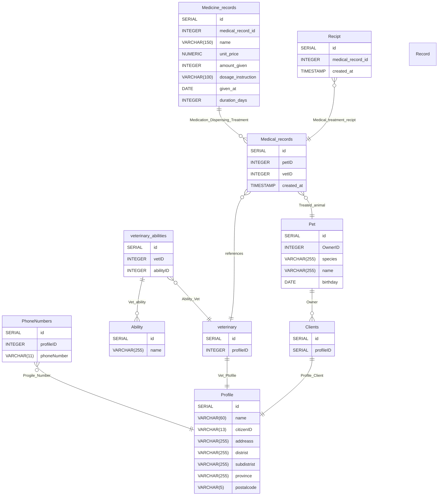

กรณีศึกษา: “ใจดีคลินิกรักษาสัตว์”
เจ้าของสัตว์มีเบอร์โทรได้หลายเบอร์ และมีที่อยู่ที่ต้องทำรายงานรายเขตได้ · เจ้าของหนึ่งคนพาสัตว์มาได้หลายตัว แต่สัตว์ทุกตัวต้องมีเจ้าของ · สัตว์มีวันเกิดและระบบต้องแสดงอายุได้ · การเข้ารับบริการนับเป็น “ครั้งที่ 1, 2, 3...” ของสัตว์แต่ละตัว · แต่ละครั้งมีสัตวแพทย์ผู้ตรวจหนึ่งคนและต้องระบุเสมอ · สัตวแพทย์มีความเชี่ยวชาญได้หลายด้าน · การเข้ารับบริการหนึ่งครั้งจ่ายยาได้หลายรายการ หรือไม่จ่ายเลยก็ได้ แต่ละรายการระบุขนาดยาและจำนวนวัน · เมื่อออกใบเสร็จและรับเงินแล้ว ยอดที่พิมพ์ไปต้องไม่เปลี่ยนอีก

# ตารางจำแนกแอตทริบิวต์ — ใจดีคลินิกรักษาสัตว์ (1.0)

## Profile

| Attribute | ชนิดแอตทริบิวต์ | PostgreSQL Type | เหตุผล |
|---|---|---|---|
| id | Key (Primary Key), Simple | `SERIAL` | เป็นค่าที่ต้องไม่ซ้ำและใช้อ้างอิงระหว่างตาราง `SERIAL` ให้ค่าเพิ่มอัตโนมัติ เหมาะกับ surrogate key ที่ไม่มีความหมายทางธุรกิจ |
| name | Simple | `VARCHAR(60)` | ชื่อ-นามสกุลเป็นข้อความยาวไม่แน่นอน จึงใช้ `VARCHAR` แบบจำกัดความยาวสูงสุดแทน `TEXT` เพื่อคุมขนาดข้อมูล |
| citizenID | Simple (ค่าที่ควรเป็น Key รอง/Candidate Key) | `CHAR(13)` | เลขบัตรประชาชนไทยมีความยาวคงที่ 13 หลักเสมอ จึงควรใช้ `CHAR(13)` แทน `VARCHAR(13)` เพื่อสะท้อนว่าความยาวตายตัว และควรเพิ่ม `UNIQUE` constraint เนื่องจากเป็นค่าที่ไม่ซ้ำกันในความเป็นจริง |
| addreass, distrist, subdistrist, province, postalcode | Composite (ย่อยจาก "ที่อยู่") แต่ละส่วนเป็น Simple | `VARCHAR(255)` (ที่อยู่/อำเภอ/ตำบล/จังหวัด), `CHAR(5)` (รหัสไปรษณีย์) | ที่อยู่เป็นแอตทริบิวต์เชิงประกอบ (composite) จึงถูกแตกเป็นส่วนย่อยแยกคอลัมน์ตามที่ทำไว้แล้ว เพื่อให้ทำรายงานแยกตามเขต/จังหวัดได้ตามที่โจทย์ระบุ ส่วนรหัสไปรษณีย์ควรเป็น `CHAR(5)` เพราะความยาวคงที่ 5 หลักเสมอ |

## PhoneNumbers

| Attribute | ชนิดแอตทริบิวต์ | PostgreSQL Type | เหตุผล |
|---|---|---|---|
| id | Key, Simple | `SERIAL` | ใช้เป็น surrogate key ของแต่ละเบอร์โทร |
| profileID | Simple (Foreign Key) | `INTEGER` | อ้างอิงเจ้าของเบอร์โทร ตารางนี้คือการ normalize แอตทริบิวต์ Multivalued "เบอร์โทร" ของ Profile ให้แยกเป็นตารางลูก เพราะเจ้าของหนึ่งคนมีได้หลายเบอร์ |
| phoneNumber | Simple | `VARCHAR(11)` | เบอร์โทรไทยส่วนใหญ่ยาว 10 หลัก แต่เผื่อรูปแบบมีขีดหรือรหัสพิเศษบางกรณีจึงใช้ `VARCHAR` แทน `CHAR` เพื่อความยืดหยุ่น |

## Pet

| Attribute | ชนิดแอตทริบิวต์ | PostgreSQL Type | เหตุผล |
|---|---|---|---|
| id | Key, Simple | `SERIAL` | surrogate key ของสัตว์แต่ละตัว |
| OwnerID | Simple (Foreign Key) | `INTEGER` | อ้างอิงเจ้าของ (Clients) ตามกฎที่ว่าสัตว์ทุกตัวต้องมีเจ้าของ จึงตั้งเป็น `NOT NULL` |
| species | Simple | `VARCHAR(255)` | ชนิดสัตว์เป็นข้อความ ความยาวไม่แน่นอนแต่ไม่มาก |
| name | Simple | `VARCHAR(255)` | ชื่อสัตว์เลี้ยง |
| birthday | Simple | `DATE` | เก็บวันเกิดจริง ส่วน **อายุ (age) เป็น Derived Attribute** — ไม่ควรมีคอลัมน์เก็บอายุตรง ๆ เพราะคำนวณได้จาก `birthday` ทุกครั้งที่ query เช่น `AGE(CURRENT_DATE, birthday)` ทำให้ข้อมูลไม่ล้าสมัยเมื่อเวลาผ่านไป |

## Clients

| Attribute | ชนิดแอตทริบิวต์ | PostgreSQL Type | เหตุผล |
|---|---|---|---|
| id | Key, Simple | `SERIAL` | surrogate key ของ Client |
| profileID | Simple (Foreign Key, Unique) | `INTEGER` | ความสัมพันธ์แบบ 1:1 กับ Profile (Client คือ Profile ที่ทำหน้าที่เป็นเจ้าของสัตว์) จึงมี `UNIQUE` กำกับเพื่อไม่ให้ Profile เดียวถูกผูกเป็น Client ซ้ำ |

## veterinary (สัตวแพทย์)

| Attribute | ชนิดแอตทริบิวต์ | PostgreSQL Type | เหตุผล |
|---|---|---|---|
| id | Key, Simple | `SERIAL` | surrogate key ของสัตวแพทย์ |
| profileID | Simple (Foreign Key, ควรเป็น Unique) | `INTEGER` | เช่นเดียวกับ Clients คือ Profile ที่ทำหน้าที่เป็นสัตวแพทย์ ความสัมพันธ์ 1:1 กับ Profile |

## veterinary_abilities

| Attribute | ชนิดแอตทริบิวต์ | PostgreSQL Type | เหตุผล |
|---|---|---|---|
| id | Key, Simple | `SERIAL` | surrogate key ของแถวความสัมพันธ์ |
| vetID, abilityID | Simple (Composite Foreign Key ของความสัมพันธ์ M:N) | `INTEGER` | ตารางนี้คือ junction table ที่ normalize แอตทริบิวต์ Multivalued "ความเชี่ยวชาญ" ของสัตวแพทย์ เพราะสัตวแพทย์หนึ่งคนมีได้หลายความเชี่ยวชาญ และความเชี่ยวชาญหนึ่งอย่างก็มีสัตวแพทย์ได้หลายคน |

## Ability

| Attribute | ชนิดแอตทริบิวต์ | PostgreSQL Type | เหตุผล |
|---|---|---|---|
| id | Key, Simple | `SERIAL` | surrogate key |
| name | Simple | `VARCHAR(255)` | ชื่อความเชี่ยวชาญ |

## Medical_records (ประวัติการรักษา / ครั้งที่เข้ารับบริการ)

| Attribute | ชนิดแอตทริบิวต์ | PostgreSQL Type | เหตุผล |
|---|---|---|---|
| id | Key, Simple | `SERIAL` | surrogate key ของการเข้ารับบริการแต่ละครั้ง |
| petID | Simple (Foreign Key) | `INTEGER` | สัตว์ที่เข้ารับบริการ, `NOT NULL` |
| vetID | Simple (Foreign Key) | `INTEGER` | สัตวแพทย์ผู้ตรวจ ต้องระบุเสมอตามกฎธุรกิจ จึงเป็น `NOT NULL` |
| created_at | Simple | `TIMESTAMP` | เวลาที่เข้ารับบริการ และเป็นฐานของ **Derived Attribute "ครั้งที่ N"** — ลำดับครั้งที่ (1, 2, 3, ...) ของสัตว์แต่ละตัวไม่ควรถูกเก็บเป็นคอลัมน์ตรง ๆ แต่คำนวณได้จาก `ROW_NUMBER() OVER (PARTITION BY petID ORDER BY created_at)` เพื่อไม่ให้ข้อมูลผิดเพี้ยนหากมีการแทรก/ลบประวัติย้อนหลัง |

## Recipt (ใบเสร็จ)

| Attribute | ชนิดแอตทริบิวต์ | PostgreSQL Type | เหตุผล |
|---|---|---|---|
| id | Key, Simple | `SERIAL` | surrogate key ของใบเสร็จ |
| medical_record_id | Simple (Foreign Key) | `INTEGER` | อ้างอิงการเข้ารับบริการที่ออกใบเสร็จ |
| created_at | Simple | `TIMESTAMP` | เวลาที่ออกใบเสร็จ |
| **(ควรเพิ่ม) total_amount** | Derived-but-Stored | `NUMERIC(10,2)` | ยอดรวมคำนวณได้จาก Medicine_records ที่เกี่ยวข้อง (`unit_price × amount_given` รวมทุกรายการ) แต่ตามกฎธุรกิจ "เมื่อออกใบเสร็จและรับเงินแล้ว ยอดที่พิมพ์ไปต้องไม่เปลี่ยนอีก" จึง **ต้องเก็บค่าที่คำนวณไว้ ณ เวลาที่พิมพ์ลงคอลัมน์จริง** แทนที่จะคำนวณสดทุกครั้ง (freeze value) ไม่เช่นนั้นหากราคายาถูกแก้ไขภายหลัง ยอดในใบเสร็จเก่าจะเปลี่ยนตามไปด้วยซึ่งผิดกฎ |

## Medicine_records (รายการยาที่จ่ายในแต่ละครั้ง)

| Attribute | ชนิดแอตทริบิวต์ | PostgreSQL Type | เหตุผล |
|---|---|---|---|
| id | Key, Simple | `SERIAL` | surrogate key ของรายการยา |
| medical_record_id | Simple (Foreign Key) | `INTEGER` | อ้างอิงการเข้ารับบริการที่จ่ายยานี้ (หนึ่งครั้งจ่ายได้หลายรายการ หรือไม่จ่ายเลยก็ได้ จึงไม่ต้องมี record หากไม่มีการจ่ายยา) |
| name | Simple | `VARCHAR(150)` | ชื่อยา |
| unit_price | Simple | `NUMERIC(10,2)` | ราคาต่อหน่วยเป็นเงิน ควรใช้ `NUMERIC` ไม่ใช่ `FLOAT`/`REAL` เพื่อความแม่นยำของทศนิยมเงินตรา และกำหนด scale 2 ตำแหน่งตามหน่วยสตางค์ |
| amount_given | Simple | `INTEGER` | จำนวนหน่วยยาที่จ่าย เป็นจำนวนเต็ม |
| dosage_instruction | Simple | `VARCHAR(100)` | คำแนะนำขนาด/วิธีใช้ยา เป็นข้อความสั้น |
| given_at | Simple | `DATE` | วันที่เริ่มจ่ายยา |
| duration_days | Simple | `INTEGER` | จำนวนวันที่ต้องใช้ยา |
| **(Derived, ไม่เก็บ)** total_price ต่อรายการ | Derived | — | คำนวณได้จาก `unit_price × amount_given` ทุกครั้งที่ query ไม่จำเป็นต้องเก็บเป็นคอลัมน์แยก เพราะเป็นยาแต่ละรายการที่ยังไม่ถูกพิมพ์ลงใบเสร็จถาวร (ต่างจาก Recipt.total_amount ที่ freeze แล้ว) |

---

### สรุปแอตทริบิวต์ที่ควรจับตาเป็นพิเศษ
- **Multivalued → normalize เป็นตารางลูก:** เบอร์โทร (PhoneNumbers), ความเชี่ยวชาญของสัตวแพทย์ (veterinary_abilities)
- **Composite → แตกเป็น Simple หลายคอลัมน์:** ที่อยู่ใน Profile
- **Derived (คำนวณสด ไม่เก็บ):** อายุสัตว์, ครั้งที่เข้ารับบริการ, ราคารวมต่อรายการยา
- **Derived-but-Stored (คำนวณครั้งเดียวแล้ว freeze):** ยอดรวมในใบเสร็จ (Recipt.total_amount) — ยังขาดคอลัมน์นี้ใน schema ปัจจุบัน ควรเพิ่ม

Relationships
| ความสัมพันธ์ | Cardinality | คำอธิบายสั้น |
|---|---|---|
| Profile – Clients | 1 : 1 | Profile ที่ทำหน้าที่เป็นเจ้าของสัตว์ |
| Profile – veterinary | 1 : 1 | Profile ที่ทำหน้าที่เป็นสัตวแพทย์ |
| Profile – PhoneNumbers | 1 : N | เจ้าของ 1 คนมีได้หลายเบอร์โทร |
| Clients – Pet | 1 : N | เจ้าของ 1 คนมีสัตว์ได้หลายตัว แต่สัตว์ทุกตัวต้องมีเจ้าของ (total participation) |
| veterinary – Ability | M : N (ผ่าน veterinary_abilities) | สัตวแพทย์มีความเชี่ยวชาญได้หลายด้าน และความเชี่ยวชาญหนึ่งอย่างมีสัตวแพทย์ได้หลายคน |
| Pet – Medical_records | 1 : N | สัตว์ 1 ตัวเข้ารับบริการได้หลายครั้ง |
| veterinary – Medical_records | 1 : N | สัตวแพทย์ 1 คนตรวจได้หลายครั้ง แต่ทุกครั้งต้องมีสัตวแพทย์ผู้ตรวจเสมอ (mandatory) |
| Medical_records – Medicine_records | 1 : N (0 ได้) | การเข้ารับบริการ 1 ครั้งจ่ายยาได้หลายรายการ หรือไม่จ่ายเลยก็ได้ |
| Medical_records – Recipt | 1 : 1 | การเข้ารับบริการ 1 ครั้งออกใบเสร็จ 1 ใบ |
